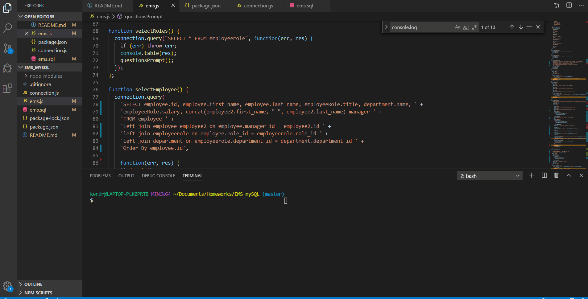

# EmployeeManagementSystem


  # EmployeeTracker
  https://github.com/kkwoka/EmployeeTracker
  ​
  ## Description
  ​
  This uses mySQL, javascript, and node to create / update tables and information listed on them. 
  ​
  ## Table of Contents 
  * [GIF](#GIF)

  * [Installation](#installation)
  ​
  * [Usage](#usage)
  ​  ​
  * [Tests](#tests)
  ​
  * [Questions](#questions)

  ## GIF
  
  ​
  ## Installation
  ​
  To install necessary dependencies, run the following command:
  ```
  npm i
  ```
  ## Usage
  ​
  node, terminal, inquirer
  ​
  ## Tests
  ​
  To run tests, run the following command:
  ```
  node ems.js
  ```
 
  ## Questions
  ​
  
  ​
  If you have any questions about the repo, contact [kkwoka](https://github.com/kkwoka).